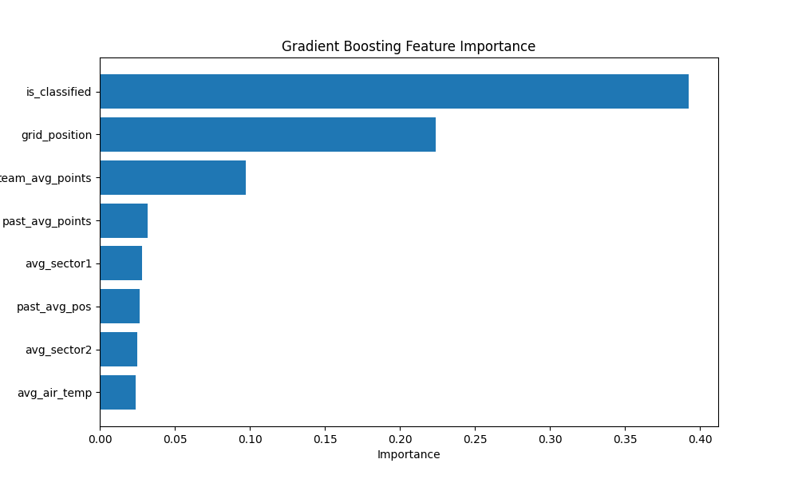

# Formula 1 Race Outcome Prediction



Predicting **Formula 1 driver finishing positions** using machine learning on historical race telemetry.

This project builds an end-to-end pipeline that collects Formula 1 race data from the **FastF1 API**, processes lap telemetry into race-level features, and trains regression models to predict race outcomes.

The dataset spans **2018–2025 seasons** and contains roughly **~200,000 lap telemetry records**.

---

# Project Pipeline

```
FastF1 API
   ↓
collect_fastf1_data.py
   ↓
season_*.csv (lap telemetry)
   ↓
data_prep.py
   ↓
driver-race dataset
   ↓
EDA (R)
   ↓
Machine Learning Models
```

The final dataset contains **one row per driver per race**, with features describing race conditions, driver performance, and team strength.

---

# Repository Structure

```
f1-race-predictor
│
├── src
│   ├── collect_fastf1_data.py
│   ├── data_prep.py
│   └── modeling.py
│
├── analysis
│   └── eda.R
│
├── data
│   ├── raw
│   └── processed
│
├── plots
│   └── visualizations
│
└── report
    └── project report and methodology
```

---

# Models

Two regression models were implemented:

**Linear Regression**

* baseline model

**Random Forest Regressor**

* ensemble model capturing non-linear relationships

Evaluation metrics:

```
RMSE
MAE
R²
```

Test set: **2024–2025 seasons**

---

# Example Results

| Model             | RMSE | MAE  | R²   |
| ----------------- | ---- | ---- | ---- |
| Linear Regression | 4.35 | 3.49 | 0.43 |
| Random Forest     | 4.60 | 3.68 | 0.36 |

Grid position, team performance, and driver historical results were among the strongest predictors.

---

# Running the Project

Install dependencies:

```
pip install -r requirements.txt
```

Collect race telemetry:

```
python src/collect_fastf1_data.py
```

Process the dataset:

```
python src/data_prep.py
```

Generate analysis plots:

```
Rscript analysis/eda.R
```

Train models:

```
python src/modeling.py
```

---

# Tech Stack

Python
R
FastF1 API
pandas
scikit-learn
ggplot2
matplotlib

---

# License

MIT License

---