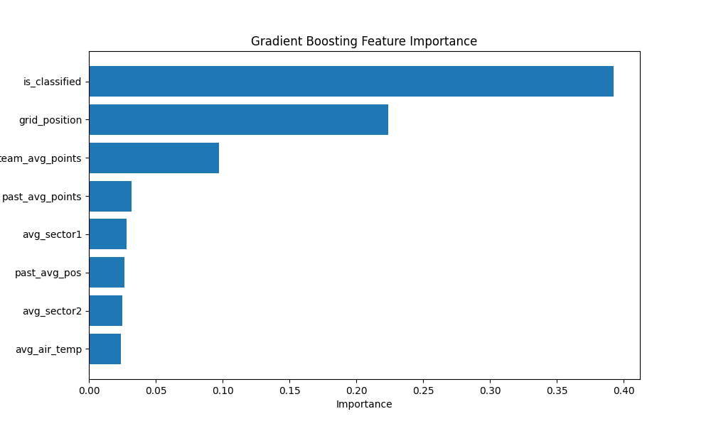

# 🏎️ Formula 1 Race Outcome Prediction



Predicting **Formula 1 driver finishing positions** using machine learning on historical race telemetry.

This project is an end-to-end pipeline that collects Formula 1 race data from the **[FastF1](https://docs.fastf1.dev/) API**, processes raw lap telemetry into race-level features, explores the data in R, and trains a suite of regression models — from a linear baseline up to a PyTorch neural network with entity embeddings — to predict where each driver finishes. Everything is wrapped in an interactive **Streamlit** dashboard for analytics, model evaluation, and live "what-if" race simulation.

The dataset spans the **2018–2025 seasons** and contains roughly **~200,000 lap telemetry records**, aggregated down to **one row per driver per race**.

---

## Highlights

- **Real telemetry, not toy data** — grid position, sector times, tyre compounds, weather, and results pulled straight from official F1 timing via FastF1.
- **Leakage-aware feature engineering** — driver/team form features are computed with an expanding mean shifted by one race, so the model never sees the future.
- **Time-based train/test split** — trained on 2018–2023, evaluated on the held-out 2024–2025 seasons (no random shuffling across time).
- **Four models compared** — Linear Regression, Random Forest, Gradient Boosting, and a PyTorch MLP with categorical embeddings.
- **Interactive dashboard** — explore historical trends, compare model accuracy, and run hypothetical race simulations in the browser.

---

## Project Pipeline

```
FastF1 API
   │
   ▼
src/collect_fastf1_data.py     →  season_YYYY.csv   (raw lap telemetry → data/raw/)
   │
   ▼
src/data_prep.py               →  f1_driver_race.csv (one row per driver per race)
   │
   ├──────────────► analysis/eda.R          →  static EDA plots (outputs/plots/)
   │
   ├──────────────► src/modeling.py         →  Linear / Random Forest / Gradient Boosting
   │
   └──────────────► src/dl_data_prep.py     →  scaled + encoded tensors (data/dl_processed/)
                          │
                          ▼
                    src/dl_modeling.py       →  PyTorch MLP (models/f1_dl_model.pth)
                          │
                          ▼
                    app.py                    →  Streamlit dashboard
```

---

## Repository Structure

```
f1-race-predictor
│
├── src
│   ├── collect_fastf1_data.py   # Pull raw lap telemetry from the FastF1 API
│   ├── data_prep.py             # Clean + aggregate laps → driver-race dataset
│   ├── modeling.py              # Linear Regression, Random Forest, Gradient Boosting
│   ├── dl_data_prep.py          # Scaling + label encoding for the neural net
│   └── dl_modeling.py           # PyTorch MLP with entity embeddings
│
├── analysis
│   └── eda.R                    # Exploratory analysis + ggplot2 visualizations
│
├── data
│   ├── raw                      # season_YYYY.csv (lap-level telemetry)
│   ├── processed                # f1_cleaned_laps.csv, f1_driver_race.csv
│   ├── feature_importance.csv
│   └── model_predictions.csv
│
├── outputs
│   ├── plots                    # EDA + feature-importance figures
│   └── screenshots              # Streamlit dashboard captures
│
├── reports                      # Methodology report + improvement notes (md + pdf)
│
├── app.py                       # Interactive Streamlit dashboard
├── requirements.txt
└── LICENSE
```

---

## Dataset & Features

Each row in the final dataset (`data/processed/f1_driver_race.csv`) describes **one driver's race**, aggregated from all of their laps.

| Category            | Features |
| ------------------- | -------- |
| **Grid & result**   | `grid_position`, `finish_position`, `points`, `position_gain`, `is_classified` |
| **Driver / team form** | `past_avg_pos`, `past_avg_points`, `team_avg_points` *(expanding means, shifted 1 race)* |
| **Pace**            | `avg_lap_time`, `best_lap_time`, `std_lap_time`, `avg_sector1/2/3` |
| **Strategy**        | `main_compound`, `pit_stop_count` |
| **Conditions**      | `avg_air_temp`, `avg_track_temp`, `avg_humidity`, `rain_probability` |
| **Categoricals**    | `driver`, `team`, `race_name` |

**Target:** `finish_position` (regression).

---

## Models

Four regression models are trained and compared:

| Model | Notes |
| ----- | ----- |
| **Linear Regression** | Scaled baseline (`StandardScaler` + `LinearRegression`). |
| **Random Forest Regressor** | Tuned via `RandomizedSearchCV` with a `TimeSeriesSplit` cross-validator. |
| **Gradient Boosting Regressor** | Tree ensemble using error-correction boosting; source of the exported feature importances. |
| **Deep Learning (PyTorch MLP)** | Multi-layer perceptron with learned embeddings for `driver`, `team`, `race_name`, and `main_compound`, feeding a wide `256 → 128 → 1` architecture. |

**Evaluation metrics:** RMSE, MAE, R²
**Train:** 2018–2023 &nbsp;·&nbsp; **Test:** 2024–2025 (held out by time)

### Example Results

| Model              | RMSE | MAE  | R²   |
| ------------------ | ---- | ---- | ---- |
| Linear Regression  | 3.75 | 2.97 | 0.57 |
| Gradient Boosting  | 3.20 | 2.41 | 0.69 |
| Random Forest      | 3.11 | 2.33 | 0.71 |
| PyTorch MLP (Wide) | 2.98 | 2.12 | 0.76 |

Grid position, team strength, and driver historical form were consistently among the strongest predictors of the finishing position.

> **Note:** the neural network is deliberately tuned for peak accuracy on the held-out seasons and lightly overfits; the tree ensembles offer a more conservative, stable baseline. See [`reports/`](reports/) for the full methodology and caveats.

---

## Interactive Dashboard

The Streamlit app (`app.py`) is organised into three tabs:

- **📊 Historical Analytics** — finish-position variance per driver, grid-vs-finish correlation, sector pace by top teams, and overtaking (net positions gained).
- **🧠 Model Evaluation** — side-by-side accuracy metrics and actual-vs-predicted alignment for each model.
- **🔮 Live Predictor** — pick a driver, team, grid slot, tyre compound, and weather conditions, then simulate a hypothetical finishing position through the trained neural network.

| Live Predictor | Model Evaluation |
| :---: | :---: |
|  |  |

---

## Running the Project

**1. Install dependencies**

```bash
pip install -r requirements.txt
```

**2. Collect race telemetry** — pulls laps from the FastF1 API into `season_YYYY.csv`. The script's `YEAR` variable at the top controls the season; run it once per season and move the outputs into `data/raw/`.

```bash
python src/collect_fastf1_data.py
```

**3. Clean & aggregate** into the driver-race dataset:

```bash
python src/data_prep.py
```

**4. Generate EDA plots** (requires R):

```bash
Rscript analysis/eda.R
```

**5. Train the classic models** (Linear Regression, Random Forest, Gradient Boosting):

```bash
python src/modeling.py
```

**6. Train the deep learning model** (PyTorch MLP):

```bash
python src/dl_modeling.py
```

**7. Launch the interactive dashboard:**

```bash
python -m streamlit run app.py
```

> The dashboard's Live Predictor needs the deep-learning artifacts (`models/f1_dl_model.pth` and the encoders in `data/dl_processed/`), so run step 6 before launching if you want simulations enabled.

---

## Tech Stack

- **Languages:** Python, R
- **Data:** FastF1 API, pandas, numpy
- **Modeling:** scikit-learn, PyTorch, statsmodels
- **Visualization:** Streamlit, Plotly, matplotlib, ggplot2 / tidyverse

---

## License

This project is licensed under the **MIT License** — see the [LICENSE](LICENSE) file for details.

---

## Authors

- **Skandan Suresh** (GitHub: [SilverSouls226](https://github.com/SilverSouls226))
- **Samyuktha Subramanian** (GitHub: [Samyuktha-21](https://github.com/Samyuktha-21))
